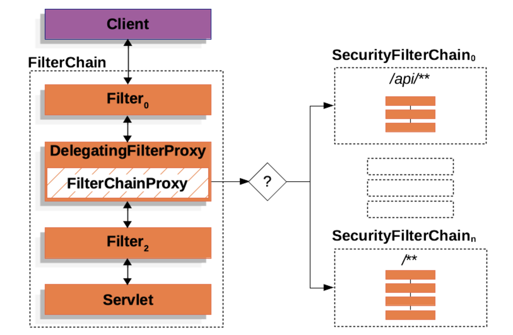

[TOC]

# RocketMQ

## Name Server

- **Broker Management**: The Name Server registers brokers and monitors their status, ensuring that producers and consumers have up-to-date information about broker availability. (Broker sends heart beats to name server every 30 seconds, name server checks heart beat data every 10 seconds. If a broker fails to send heartbeat in 120 seconds, it will get de-registered )
- **Routing Management**: It maintains a complete routing/topic table, allowing users to determine the appropriate broker for message storage or retrieval.
- **High avalibility**: **Nameserver Peer Mode** refers to a configuration setup in which multiple nameservers operate in a peer-to-peer manner, enabling high availability and fault tolerance.

## Broker

- **High Availability**: Use master-slave mode with automatic failover to ensure fault tolerance. (Master broker has brokerID=0, slaves have brokerID > 0)
- **Message Storage**: Mesages are read and write through disks

## Topic

- **Topic-Broker Link**: when a topic is created, there are 4 write-queues and 4 read queues created and connected to the disk location of different brokers in the cluster.

## Producer

- **Fetch topic table**: Producer fetches topic and queue table from name server every 30 seconds

- **Load Balanced Messages**: By default, producer sends messages to queue with load balancing approach. 

-  **Orderly Messages**, To ensure a messages group processed orderly, need to send them into the same queue. We can use hash method to send messages to the same queue.

- **Commit Log **:

  

## Queue

- 

# Redis

## Lock

In high-concurrency scenario, we need to **lock the resource** to make sure there is only **one user** access it at the time.

### Deadlock

There are situations we might encounter deadlocks:

1. Program throw exception: use try-finally clause
2. Program is down: set expiration time for the lock but need to make sure to set the lock and expiration date in the **atomic way**.

### Lock Expiration

There are also times the time required to complete a task exceeds the lock expiration time. Thus, we need to refresh lock expiration time if the program cannot finish before the expiration time.

Redison provides a method to set the lock with expiration and put a timeout watch listener to ensure that it refreshes the expiration time while the program is running.

# Spring Security

## Architecture

Spring Security Servlet support is based on Servelet Filters. The client sends a request to the application, and the container creates a `FilterChain`, which contains the `Filter` instances and `Servlet` that should process the `HttpServletRequest`.

Spring provides a `Filter` implementation named [`DelegatingFilterProxy`](https://docs.spring.io/spring-framework/docs/6.2.0/javadoc-api/org/springframework/web/filter/DelegatingFilterProxy.html) that allows bridging between the Servlet container’s lifecycle and Spring’s `ApplicationContext`. 

### FilterChain Proxy  

1.  `FilterChainProxy` provides a starting point for all of Spring Security’s Servlet support. For that reason, if you try to troubleshoot Spring Security’s Servlet support, adding a debug point in `FilterChainProxy` is a great place to start.
2. Second, since `FilterChainProxy` is central to Spring Security usage, it can perform tasks that are not viewed as optional. For example, it clears out the `SecurityContext` to avoid memory leaks. It also applies Spring Security’s [`HttpFirewall`](https://docs.spring.io/spring-security/reference/servlet/exploits/firewall.html#servlet-httpfirewall) to protect applications against certain types of attacks.
3. In addition, it provides more flexibility in determining when a `SecurityFilterChain` should be invoked. `FilterChainProxy` can determine invocation based upon anything in the `HttpServletRequest` by using the `RequestMatcher` interface.

### DefaultSecurityFilterChain

There are 16 filters registered in the `DefaultSecurityFilterChain`

1. **DisableEncodeUrlFilter**
   - Disables URL encoding for session management when cookies are used, avoiding unnecessary URL rewriting.
2. **WebAsyncManagerIntegrationFilter**
   - Integrates Spring Security with `WebAsyncManager` for handling asynchronous requests. Ensures the `SecurityContext` is propagated correctly during async processing.
3. **SecurityContextHolderFilter**
   - Replaces the `SecurityContextPersistenceFilter` in modern Spring Security. It ensures the `SecurityContext` is cleared after the request processing, preventing data leaks between threads.
4. **HeaderWriterFilter**
   - Writes additional HTTP headers to the response for security purposes, such as `X-Content-Type-Options`, `X-Frame-Options`, and `X-XSS-Protection`.
5. **CorsFilter**
   - Handles Cross-Origin Resource Sharing (CORS) by validating requests against the CORS policy (e.g., headers, origin, and methods allowed).
6. **CsrfFilter**
   - Protects against Cross-Site Request Forgery (CSRF) attacks by validating CSRF tokens in requests that modify server state.
7. **LogoutFilter**
   - Manages the logout process, invalidating the user session, and clearing the authentication information.
8. **UsernamePasswordAuthenticationFilter**
   - Handles form-based authentication by processing login credentials (username and password) and establishing an authentication token.
9. **DefaultLoginPageGeneratingFilter**
   - Generates a default login page if no custom login page is provided in the application configuration.
10. **DefaultLogoutPageGeneratingFilter**
    - Generates a default logout page if no custom logout page is configured.
11. **BasicAuthenticationFilter**
    - Supports HTTP Basic authentication, validating credentials sent in the `Authorization` header of HTTP requests.
12. **RequestCacheAwareFilter**
    - Ensures that the original requested URL (before redirection for authentication) is retained and restored after successful authentication.
13. **SecurityContextHolderAwareRequestFilter**
    - Enhances the `HttpServletRequest` with Spring Security features like `isUserInRole()` and `getUserPrincipal()`.
14. **AnonymousAuthenticationFilter**
    - Provides a default anonymous authentication object for users who are not authenticated, allowing basic access to public resources.
15. **ExceptionTranslationFilter**
    - Catches security-related exceptions (e.g., `AccessDeniedException` or `AuthenticationException`) and handles them, typically redirecting users to an error page or login page.
16. **AuthorizationFilter**
    - Replaces the older `FilterSecurityInterceptor` in modern Spring Security. It checks whether a user is authorized to access a resource based on their roles or authorities.

## Authentication

